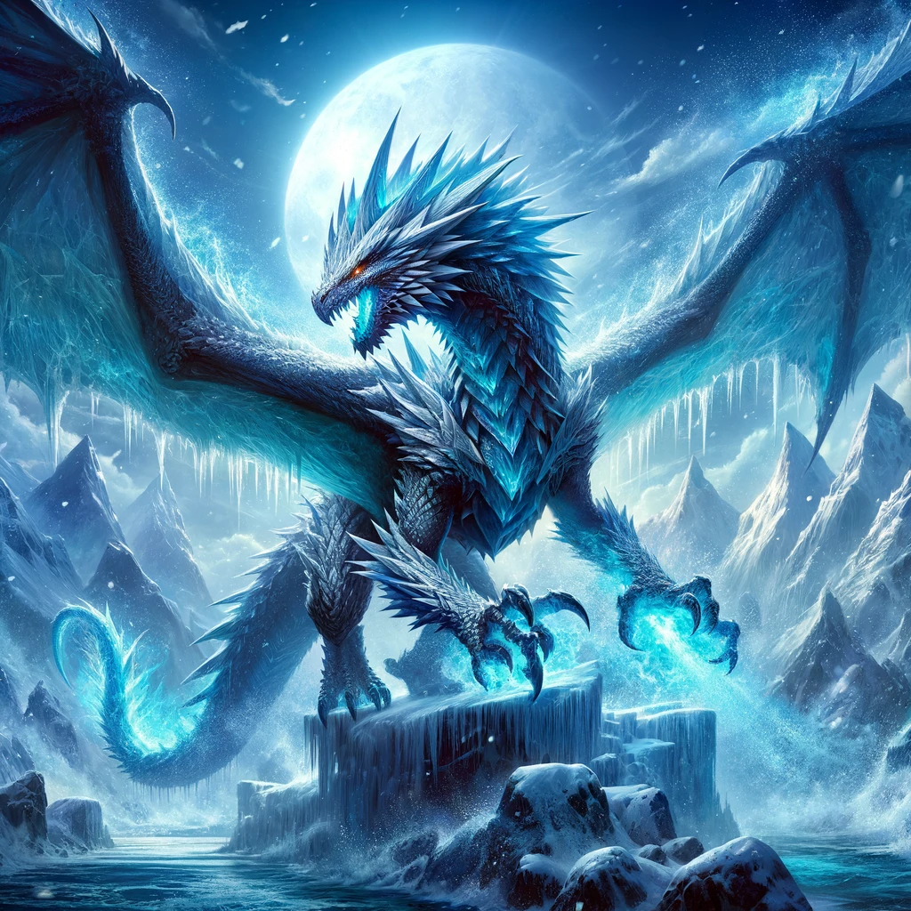

# Mysticon Legends: Exploring Sui Move from a Game Developer's Perspective

## Mysticon Legends

Welcome to the Mysticon Legends, an engaging blockchain-based game where players collect, train, and battle with mythical creatures called Mysticons. Powered by Sui Move, this game introduces a unique ecosystem of NFTs, allowing players to truly own, upgrade, and trade their Mysticons in a vibrant, dynamic world.

### Game Overview

In Mysticon Arena, each player embarks on a journey to discover and nurture a variety of Mysticons, each possessing unique abilities and powers. From fiery dragons to mystical unicorns, your Mysticons will grow in strength and skill as you train them for battle. Compete in the arena, uncover treasures, and climb the ranks to become the ultimate Mysticon Champion.

### Features

- **Collectible Mysticons**: Discover a variety of mystical creatures with unique abilities.
- **Exclusive Minting**: Only the game admin can mint Mysticons, ensuring exclusive in-game characters.
- **Give Admin rights to more administrators**: Every new admin will be able to perform administrative tasks 
- **Custodial Wallet Play**: Mysticons live in game-managed custodial wallets, facilitating secure and seamless player interaction.
- **In game Evolution**: Performing specific actions (e.g., training Mysticons) enables the game to upgrade Mysticon abilities..
- **Enhance Msticon abilities with `Creatures`**: The newly created creature is attached as a dynamic object field to the Mysticon.
- **Ownership & Trading**: Players have the freedom to export Mysticons from the game, holding or trading them with others.
- **GamePass Reintegration**: To return a Mysticon to the game, players purchase a GamePass, transferring the Mysticon back to a custodial wallet to continue their train.

## Mysticons

| Frostwing | Starshine | Stoneheart | Galeclaw | Emberflame |
|-----------|-----------|------------|----------|-----------|
|  |  |  |  |  |
| The Frost Dragon, Frostwing, commands the ice element with its ability to unleash a devastating Ice Storm, slowing and damaging enemies over time. | Starshine, the Mystic Unicorn, radiates healing and hope, with its Healing Aura gradually restoring health to itself and nearby allies. | The Terra Golem, Stoneheart, embodies the earth element, with its Earthquake ability causing tremors that can damage and potentially stun all enemies. | Galeclaw, the Storm Griffin, masters the air with its Lightning Strike, calling down a lightning bolt to deal massive damage to a single target. | Emberflame, the Blaze Phoenix, epitomizes fire, with its Phoenix Rebirth allowing it to revive with full health once per battle. |

## Creatures
| Glimmerwing | Pyroclaw | Frostbite |
|-----------|-----------|------------|
| Glimmerwing - A mystical fairy-like creature with iridescent wings that shimmer in the light. Glimmerwing is known for its ability to harness the energy of the stars, providing its Mysticon with enhanced magical abilities and the occasional guidance to hidden treasures. Its presence also has a calming effect, improving the focus and accuracy of its companion in battle. | 

| Pyroclaw - This small dragon hatchling breathes miniature flames and thrives in the heat of battle. Pyroclaw can imbue its Mysticon with a fiery aura, slightly increasing their attack power and providing resistance against cold-based attacks. Over time, Pyroclaw's bond with its Mysticon strengthens, allowing it to unleash a powerful fire blast once per battle. |

| Frostbite - A playful yet fiercely loyal arctic fox spirit that radiates a chilling aura. Frostbite can envelope its Mysticon in a protective frost shield, reducing damage from enemy attacks. Its icy touch can also slow down opponents, giving its Mysticon an edge in speed and reaction time during critical moments of combat. |

## GamePass: Your Gateway to Mysticon Evolution

In Mysticon Arena, the evolution and training of your Mysticon are paramount. The "GamePass" system ensures your Mysticons continue to advance, offering a seamless bridge between in-game progression and true NFT ownership.

### Why GamePass?

- **Continuous Training**: Allows your Mysticon to keep evolving, unlocking new strengths and abilities.
- **True Ownership**: Export your Mysticons to your personal wallet, maintaining their development potential.
- **Seamless Re-entry**: Reintegrate your Mysticon into the game easily, resuming their growth and adventures.

### How It Works

Exporting Mysticons: Securely export your Mysticon to your personal wallet for true ownership and flexibility.

### Using GamePass

When you're ready to reintegrate your Mysticon into the game, use a GamePass to unlock its training status, allowing it to continue growing and evolving within the Mysticon Arena ecosystem.

GamePass empowers you to manage your Mysticons across platforms while ensuring they remain an integral part of their digital world, ready to train, evolve, and compete.

# Deployment and Usage Guide for Mysticon Legends Contracts
## 1. Setup your environment

This guide outlines the steps for deploying and using the Mysticon Legends contracts on the Sui blockchain. Ensure you have both Sui and Node.js installed on your machine before proceeding.

**1.1 Cloning the Project**

Start by cloning the Mysticon Legends project repository:

    git clone https://github.com/MystenLabs/mysticon-legends

**1.2 Verifying Sui Installation**

Check that Sui is installed successfully on your system:

    sui --version

**1.3 Configuring Sui for Devnet**

Configure the Sui client to use the devnet RPC:

    sui client new-env --alias devnet --rpc https://fullnode.devnet.sui.io:443

**1.4 Switching to the Devnet Environment**

Change your Sui client to the devnet environment:

    sui client switch --env devnet

**1.5 Creating a New Sui Address with your keypair**

Create a new account and save the `recoveryPhrase` for later use:

    sui client new-address ed25519

**1.6 Switch to you new Address**

Make your active address to be the newly created:

    sui client switch --address {alias}

**1.7 Acquiring Devnet Sui Tokens**

Claim test Sui tokens by replacing `{address}` with your actual Sui address:

    curl --location --request POST 'https://faucet.devnet.sui.io/gas' \
        --header 'Content-Type: application/json' \
        --data-raw '{
            "FixedAmountRequest": {
                "recipient": "{address}"
            }
        }'

**1.8 Verify your Sui token balance:**
    
    sui client gas

## 2. Deploy Your Smart Contracts on Devnet

**2.1 Preparing the Publish Script**

Navigate to the /setup directory and grant execute permissions to the publish.sh script:
  
    chmod +x publish.sh

**2.2 Installing Dependencies**

Install necessary library dependencies:

    npm install

**2.3 Deploying Contracts**

Deploy your contracts to the devnet and populate the .env file in the setup/src folder:

    ./publish.sh devnet

**2.4 Configuring the .env File**

Open the src/.env file and fill in the `ADMIN_PHRASE` with the `recoveryPhrase` from your Sui account creation and the `ADMIN_ADDRESS` with your Sui address.

## 3. Run Typesctipt code to invoke your module functions

**3.1 Minting a New Mysticon**

Navigate to the src/ folder to run scripts. To mint a new Mysticon:

    ts-node index.js mintMysticon

**3.2 Updating Mysticon Power Level**

To update the power_level, add the Mysticon object ID you received after minting and run:

    ts-node index.js updateMysticonPowerLevel

**3.3 Attach a Creature to a Mysticon**

To attach a newly created `Creature` to an existing Mysticon you must pay a fee of 50 `power_level` points:

    ts-node index.js attachCreature

**3.4 Locking a Mysticon**

Lock your Mysticon:

    ts-node index.js lockMysticon

**3.5 Creating a Display Object**

To create a Display object for viewing on the Sui Explorer:

    ts-node index.js

**3.6 Burning a Mysticon**

If your Mysticon is not locked, you can burn it to receive a storage rebate:

    ts-node index.js burnMysticon

